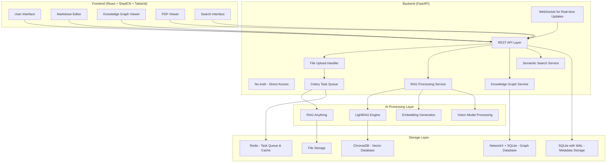

# Design Document

## Overview

The AI-focused Personal Knowledge Management (PKM) tool is designed as a modern, self-hosted solution that combines the intuitive interface patterns of Obsidian and Logseq with advanced AI capabilities. The system architecture follows a clean separation between a Python FastAPI backend and a React frontend, enabling easy deployment and maintenance while providing powerful multimodal document processing, semantic search, and knowledge graph visualization.

The system leverages RAG-Anything with MinerU 2.0 for comprehensive multimodal document processing, supporting text, images, PDFs, audio, and video content. The architecture is designed to handle 1000+ documents efficiently through asynchronous processing, background task queues, and optimized storage. All processing occurs locally or through user-configured services, ensuring complete data privacy and control.

## Architecture

### High-Level Architecture



### Technology Stack

**Backend:**
- **FastAPI**: High-performance Python web framework with automatic OpenAPI documentation
- **RAG-Anything**: Multimodal document processing and RAG capabilities
- **MinerU 2.0**: Advanced document parsing engine (integrated with RAG-Anything)
- **LightRAG**: Knowledge graph construction and semantic retrieval (includes built-in graph storage)
- **Celery + Redis**: Asynchronous task queue for background document processing
- **Pydantic**: Data validation and serialization
- **SQLite**: Lightweight database for metadata and application state (with WAL mode for concurrency)
- **ChromaDB**: Vector database for embeddings storage (embedded, optimized for 1000+ documents)
- **NetworkX**: In-memory graph processing for knowledge graph operations (with SQLite persistence)

**Frontend:**
- **React 18**: Modern React with hooks and concurrent features
- **ShadCN UI**: High-quality, accessible component library
- **Tailwind CSS**: Utility-first CSS framework for styling
- **React Router**: Client-side routing
- **React Query/TanStack Query**: Server state management and caching
- **React Markdown**: Markdown rendering with syntax highlighting
- **React PDF**: PDF viewing capabilities
- **D3.js/Vis.js**: Knowledge graph visualization

**Deployment:**
- **Docker**: Containerized deployment for both frontend and backend
- **Docker Compose**: Multi-container orchestration
- **Redis**: In-memory data store for task queue and caching
- **Nginx**: Reverse proxy and static file serving (optional)

## Scalability and Performance

### Document Processing at Scale (1000+ Documents)

**Asynchronous Processing Architecture:**
```python
# Background task processing with Celery
from celery import Celery
from celery.result import AsyncResult

celery_app = Celery(
    "pkm_tasks",
    broker="redis://localhost:6379/0",
    backend="redis://localhost:6379/0"
)

@celery_app.task(bind=True)
def process_document_task(self, document_id: str, file_path: str):
    """Background task for document processing"""
    try:
        # Update status to processing
        update_document_status(document_id, "processing")
        
        # Process with RAG-Anything + MinerU
        rag = RAGAnything(working_dir="./rag_storage")
        result = await rag.process_document_complete(
            file_path=file_path,
            parse_method="auto",
            device="cuda" if torch.cuda.is_available() else "cpu"
        )
        
        # Generate embeddings
        embeddings = await generate_embeddings(result.extracted_text)
        
        # Update knowledge graph
        await update_knowledge_graph(document_id, result)
        
        # Mark as completed
        update_document_status(document_id, "completed")
        
        return {"status": "completed", "document_id": document_id}
        
    except Exception as e:
        update_document_status(document_id, "failed", str(e))
        raise
```

**Non-blocking API Endpoints:**
```python
@app.post("/api/documents/upload")
async def upload_document(file: UploadFile = File(...)):
    """Non-blocking document upload with background processing"""
    
    # Validate and save file immediately
    document_id = str(uuid.uuid4())
    file_path = await save_uploaded_file(file, document_id)
    
    # Create database record
    document = Document(
        id=document_id,
        filename=file.filename,
        file_type=file.content_type,
        file_path=file_path,
        processing_status="queued"
    )
    await save_document(document)
    
    # Queue background processing task
    task = process_document_task.delay(document_id, file_path)
    
    # Return immediately with task ID
    return {
        "document_id": document_id,
        "task_id": task.id,
        "status": "queued",
        "message": "Document queued for processing"
    }

@app.get("/api/documents/{document_id}/status")
async def get_processing_status(document_id: str):
    """Check document processing status"""
    document = await get_document(document_id)
    
    if document.processing_status == "processing":
        # Get detailed progress from Celery task
        task = AsyncResult(document.task_id)
        return {
            "status": document.processing_status,
            "progress": task.info.get("progress", 0) if task.info else 0,
            "current_step": task.info.get("current_step", "") if task.info else ""
        }
    
    return {"status": document.processing_status}
```

**Real-time Updates with WebSockets:**
```python
from fastapi import WebSocket, WebSocketDisconnect
from typing import List

class ConnectionManager:
    def __init__(self):
        self.active_connections: List[WebSocket] = []
    
    async def connect(self, websocket: WebSocket):
        await websocket.accept()
        self.active_connections.append(websocket)
    
    def disconnect(self, websocket: WebSocket):
        self.active_connections.remove(websocket)
    
    async def broadcast_processing_update(self, message: dict):
        for connection in self.active_connections:
            try:
                await connection.send_json(message)
            except:
                await self.disconnect(connection)

manager = ConnectionManager()

@app.websocket("/ws")
async def websocket_endpoint(websocket: WebSocket):
    await manager.connect(websocket)
    try:
        while True:
            await websocket.receive_text()  # Keep connection alive
    except WebSocketDisconnect:
        manager.disconnect(websocket)

# In document processing task
async def notify_processing_update(document_id: str, status: str, progress: int = 0):
    await manager.broadcast_processing_update({
        "type": "document_processing",
        "document_id": document_id,
        "status": status,
        "progress": progress
    })
```

### Database Optimization for Large Document Collections

**SQLite Configuration for Concurrency:**
```python
import sqlite3
from contextlib import asynccontextmanager

class OptimizedSQLiteConnection:
    def __init__(self, db_path: str):
        self.db_path = db_path
        self._setup_database()
    
    def _setup_database(self):
        """Configure SQLite for optimal performance with many documents"""
        conn = sqlite3.connect(self.db_path)
        
        # Enable WAL mode for better concurrency
        conn.execute("PRAGMA journal_mode=WAL")
        
        # Optimize for read-heavy workloads
        conn.execute("PRAGMA synchronous=NORMAL")
        conn.execute("PRAGMA cache_size=10000")  # 10MB cache
        conn.execute("PRAGMA temp_store=MEMORY")
        
        # Create indexes for fast queries
        conn.execute("""
            CREATE INDEX IF NOT EXISTS idx_documents_status 
            ON documents(processing_status)
        """)
        conn.execute("""
            CREATE INDEX IF NOT EXISTS idx_documents_created 
            ON documents(created_at)
        """)
        conn.execute("""
            CREATE INDEX IF NOT EXISTS idx_notes_updated 
            ON notes(updated_at)
        """)
        
        conn.close()
```

**ChromaDB Configuration for Large Collections:**
```python
import chromadb
from chromadb.config import Settings

class ScalableVectorStore:
    def __init__(self):
        # Configure ChromaDB for large collections
        self.client = chromadb.PersistentClient(
            path="./chroma_db",
            settings=Settings(
                chroma_db_impl="duckdb+parquet",  # Better for large datasets
                persist_directory="./chroma_db"
            )
        )
        
        self.collection = self.client.get_or_create_collection(
            name="documents",
            metadata={"hnsw:space": "cosine", "hnsw:M": 16}  # Optimized HNSW params
        )
    
    async def add_embeddings_batch(self, embeddings: List[List[float]], 
                                 documents: List[str], 
                                 metadatas: List[dict],
                                 batch_size: int = 100):
        """Add embeddings in batches for better performance"""
        for i in range(0, len(embeddings), batch_size):
            batch_embeddings = embeddings[i:i + batch_size]
            batch_documents = documents[i:i + batch_size]
            batch_metadatas = metadatas[i:i + batch_size]
            batch_ids = [f"doc_{j}" for j in range(i, min(i + batch_size, len(embeddings)))]
            
            self.collection.add(
                embeddings=batch_embeddings,
                documents=batch_documents,
                metadatas=batch_metadatas,
                ids=batch_ids
            )
```

### MinerU Integration for Multimodal Processing

**MinerU 2.0 Configuration:**
```python
class MinerUProcessor:
    def __init__(self):
        self.mineru_config = {
            "parse_method": "auto",  # Automatic format detection
            "device": "cuda" if torch.cuda.is_available() else "cpu",
            "backend": "pipeline",
            "lang": "en"
        }
    
    async def process_multimodal_document(self, file_path: str, file_type: str):
        """Process documents using MinerU 2.0 through RAG-Anything"""
        
        # Configure based on file type
        if file_type.startswith("image/"):
            # Image processing with OCR
            processor = ImageModalProcessor(
                lightrag=self.lightrag,
                modal_caption_func=self.vision_model_func
            )
            
        elif file_type == "application/pdf":
            # PDF processing with text and image extraction
            result = await self.rag_anything.process_document_complete(
                file_path=file_path,
                parse_method="auto",  # MinerU auto-detection
                device=self.mineru_config["device"],
                backend=self.mineru_config["backend"]
            )
            
        elif file_type.startswith("audio/"):
            # Audio transcription
            processor = AudioModalProcessor(
                lightrag=self.lightrag,
                transcription_func=self.audio_transcription_func
            )
            
        elif file_type.startswith("video/"):
            # Video processing (extract frames + audio)
            processor = VideoModalProcessor(
                lightrag=self.lightrag,
                vision_model_func=self.vision_model_func,
                transcription_func=self.audio_transcription_func
            )
        
        return result
```

### Performance Monitoring and Optimization

**Frontend Performance for Large Document Sets:**
```tsx
// Virtualized lists for large document collections
import { FixedSizeList as List } from 'react-window';

export function DocumentsList({ documents }: { documents: Document[] }) {
  const Row = ({ index, style }: { index: number; style: React.CSSProperties }) => (
    <div style={style}>
      <DocumentItem document={documents[index]} />
    </div>
  );
  
  return (
    <List
      height={600}
      itemCount={documents.length}
      itemSize={60}
      width="100%"
    >
      {Row}
    </List>
  );
}

// Debounced search for better performance
import { useDeferredValue, useMemo } from 'react';

export function useSearch(query: string, documents: Document[]) {
  const deferredQuery = useDeferredValue(query);
  
  const filteredDocuments = useMemo(() => {
    if (!deferredQuery) return documents;
    
    return documents.filter(doc => 
      doc.title.toLowerCase().includes(deferredQuery.toLowerCase()) ||
      doc.content.toLowerCase().includes(deferredQuery.toLowerCase())
    );
  }, [deferredQuery, documents]);
  
  return filteredDocuments;
}
```

This architecture ensures the system can handle 1000+ documents efficiently while maintaining responsive user experience through asynchronous processing and real-time updates.

## Components and Interfaces

### Backend Components

#### 1. REST API Layer (`/api`)

**Core Endpoints:**
```python
# Notes Management
GET    /api/notes                    # List all notes
POST   /api/notes                    # Create new note
GET    /api/notes/{note_id}          # Get specific note
PUT    /api/notes/{note_id}          # Update note
DELETE /api/notes/{note_id}          # Delete note

# Document Processing
POST   /api/documents/upload         # Upload and process documents
GET    /api/documents                # List processed documents
GET    /api/documents/{doc_id}       # Get document details
DELETE /api/documents/{doc_id}       # Delete document

# Search and Retrieval
GET    /api/search                   # Semantic search across content
POST   /api/search/rag               # RAG-based question answering
GET    /api/search/suggestions       # Search suggestions

# Knowledge Graph
GET    /api/graph                    # Get knowledge graph data
GET    /api/graph/node/{node_id}     # Get specific node details
GET    /api/graph/relationships      # Get relationship data

# PDF Viewing
GET    /api/pdf/{doc_id}/view        # Serve PDF for viewing
GET    /api/pdf/{doc_id}/pages       # Get PDF page count and metadata
```

#### 2. File Processing Service (with MinerU 2.0)

```python
from raganything import RAGAnything
from raganything.modalprocessors import ImageModalProcessor, TableModalProcessor
import asyncio

class DocumentProcessor:
    def __init__(self):
        self.rag_anything = RAGAnything(
            working_dir="./rag_storage",
            llm_model_func=self._get_llm_function(),
            vision_model_func=self._get_vision_function(),
            embedding_func=self._get_embedding_function(),
            embedding_dim=3072,
            max_token_size=8192
        )
        
        # MinerU 2.0 is integrated within RAG-Anything
        self.mineru_config = {
            "parse_method": "auto",  # MinerU auto-detection
            "device": "cuda" if torch.cuda.is_available() else "cpu",
            "backend": "pipeline",
            "lang": "en"
        }
    
    async def process_document(self, file_path: str, file_type: str):
        """Process uploaded document through RAG-Anything with MinerU 2.0"""
        
        # MinerU 2.0 handles multimodal parsing automatically
        result = await self.rag_anything.process_document_complete(
            file_path=file_path,
            output_dir="./processed",
            parse_method=self.mineru_config["parse_method"],
            device=self.mineru_config["device"],
            backend=self.mineru_config["backend"],
            lang=self.mineru_config["lang"]
        )
        
        return {
            "extracted_text": result.get("text", ""),
            "images": result.get("images", []),
            "tables": result.get("tables", []),
            "metadata": result.get("metadata", {}),
            "processing_time": result.get("processing_time", 0)
        }
    
    async def process_multimodal_content(self, content_data: dict, content_type: str):
        """Process specific multimodal content using RAG-Anything processors"""
        
        if content_type == "image":
            processor = ImageModalProcessor(
                lightrag=self.rag_anything.lightrag,
                modal_caption_func=self._get_vision_function()
            )
            
            image_content = {
                "img_path": content_data["path"],
                "img_caption": content_data.get("caption", []),
                "img_footnote": content_data.get("footnote", [])
            }
            
            description, entity_info = await processor.process_multimodal_content(
                modal_content=image_content,
                content_type="image",
                file_path=content_data["source_file"],
                entity_name=content_data.get("entity_name", "Image")
            )
            
        elif content_type == "table":
            processor = TableModalProcessor(
                lightrag=self.rag_anything.lightrag,
                modal_caption_func=self._get_llm_function()
            )
            
            table_content = {
                "table_body": content_data["table_html"],
                "table_caption": content_data.get("caption", []),
                "table_footnote": content_data.get("footnote", [])
            }
            
            description, entity_info = await processor.process_multimodal_content(
                modal_content=table_content,
                content_type="table",
                file_path=content_data["source_file"],
                entity_name=content_data.get("entity_name", "Table")
            )
        
        return {"description": description, "entity_info": entity_info}
    
    async def batch_process_folder(self, folder_path: str, file_extensions: List[str]):
        """Process multiple documents in batch using MinerU 2.0"""
        await self.rag_anything.process_folder_complete(
            folder_path=folder_path,
            output_dir="./processed",
            file_extensions=file_extensions,
            recursive=True,
            max_workers=4  # Parallel processing
        )
    
    def _get_llm_function(self):
        """Configure LLM function for RAG-Anything"""
        # User-configurable LLM endpoint
        pass
    
    def _get_vision_function(self):
        """Configure vision model function for image processing"""
        # User-configurable vision model endpoint
        pass
    
    def _get_embedding_function(self):
        """Configure embedding function for semantic search"""
        # User-configurable embedding model
        pass
```

#### 3. Knowledge Graph Service

```python
import networkx as nx
from typing import List, Dict, Any

class KnowledgeGraphService:
    def __init__(self):
        self.graph = nx.MultiDiGraph()  # NetworkX graph for in-memory operations
        self.db = SQLiteGraphStorage()  # SQLite for persistence
        self.lightrag = None  # Will be initialized with LightRAG instance
        
    async def build_graph(self, processed_documents: List[Document]):
        """Build knowledge graph from processed documents using LightRAG"""
        # LightRAG automatically builds knowledge graph during document processing
        # Extract graph data from LightRAG's internal storage
        graph_data = await self.lightrag.get_graph_data()
        
        # Convert to NetworkX format for additional processing
        for node in graph_data.nodes:
            self.graph.add_node(node.id, **node.properties)
        
        for edge in graph_data.edges:
            self.graph.add_edge(edge.source, edge.target, 
                              relationship=edge.relationship, 
                              weight=edge.weight)
        
        # Persist to SQLite
        await self.db.save_graph(self.graph)
    
    async def get_graph_data(self, filters: dict = None):
        """Retrieve graph data for visualization"""
        # Load from SQLite if not in memory
        if self.graph.number_of_nodes() == 0:
            self.graph = await self.db.load_graph()
        
        # Apply filters and return in format suitable for frontend
        nodes = []
        edges = []
        
        for node_id, data in self.graph.nodes(data=True):
            if self._passes_filter(data, filters):
                nodes.append({
                    "id": node_id,
                    "label": data.get("label", node_id),
                    "type": data.get("type", "unknown"),
                    "properties": data
                })
        
        for source, target, data in self.graph.edges(data=True):
            edges.append({
                "source": source,
                "target": target,
                "relationship": data.get("relationship", "related"),
                "weight": data.get("weight", 1.0)
            })
        
        return {"nodes": nodes, "edges": edges}
    
    async def find_related_content(self, node_id: str):
        """Find content related to specific graph node"""
        if node_id not in self.graph:
            return []
        
        # Get neighbors and their relationships
        related = []
        for neighbor in self.graph.neighbors(node_id):
            edge_data = self.graph.get_edge_data(node_id, neighbor)
            related.append({
                "node_id": neighbor,
                "relationship": edge_data.get("relationship", "related"),
                "weight": edge_data.get("weight", 1.0)
            })
        
        return related

class SQLiteGraphStorage:
    """SQLite-based persistence for NetworkX graphs"""
    def __init__(self, db_path: str = "knowledge_graph.db"):
        self.db_path = db_path
        self._init_tables()
    
    def _init_tables(self):
        # Create tables for nodes and edges
        pass
    
    async def save_graph(self, graph: nx.MultiDiGraph):
        # Save NetworkX graph to SQLite
        pass
    
    async def load_graph(self) -> nx.MultiDiGraph:
        # Load NetworkX graph from SQLite
        pass
```

#### 4. Search Service

```python
class SearchService:
    def __init__(self):
        self.vector_db = VectorDatabase()
        self.rag_engine = RAGEngine()
    
    async def semantic_search(self, query: str, limit: int = 10):
        """Perform semantic search using embeddings"""
        query_embedding = await self._generate_embedding(query)
        results = await self.vector_db.similarity_search(
            query_embedding, limit=limit
        )
        return results
    
    async def rag_query(self, question: str, mode: str = "hybrid"):
        """Answer questions using RAG retrieval"""
        result = await self.rag_engine.query_with_multimodal(
            question, mode=mode
        )
        return result
```

### Frontend Components

#### 1. Layout Components

**Main Layout:**
```tsx
// components/layout/MainLayout.tsx
interface MainLayoutProps {
  children: React.ReactNode;
}

export function MainLayout({ children }: MainLayoutProps) {
  return (
    <div className="flex h-screen bg-background">
      <Sidebar />
      <div className="flex-1 flex flex-col">
        <Header />
        <main className="flex-1 overflow-hidden">
          {children}
        </main>
      </div>
    </div>
  );
}
```

**Sidebar Navigation:**
```tsx
// components/layout/Sidebar.tsx
export function Sidebar() {
  return (
    <div className="w-64 border-r bg-card">
      <div className="p-4">
        <SearchInput />
      </div>
      <ScrollArea className="flex-1">
        <NotesList />
        <DocumentsList />
      </ScrollArea>
      <div className="p-4 border-t">
        <Button onClick={handleNewNote}>
          <Plus className="w-4 h-4 mr-2" />
          New Note
        </Button>
      </div>
    </div>
  );
}
```

#### 2. Editor Components

**Markdown Editor:**
```tsx
// components/editor/MarkdownEditor.tsx
interface MarkdownEditorProps {
  content: string;
  onChange: (content: string) => void;
  noteId?: string;
}

export function MarkdownEditor({ content, onChange, noteId }: MarkdownEditorProps) {
  return (
    <div className="flex h-full">
      <div className="flex-1 border-r">
        <Textarea
          value={content}
          onChange={(e) => onChange(e.target.value)}
          className="h-full resize-none border-0 focus:ring-0"
          placeholder="Start writing..."
        />
      </div>
      <div className="flex-1">
        <MarkdownPreview content={content} />
      </div>
    </div>
  );
}
```

#### 3. Knowledge Graph Visualization

```tsx
// components/graph/KnowledgeGraph.tsx
export function KnowledgeGraph() {
  const [graphData, setGraphData] = useState<GraphData | null>(null);
  const svgRef = useRef<SVGSVGElement>(null);
  
  useEffect(() => {
    if (graphData && svgRef.current) {
      renderGraph(svgRef.current, graphData);
    }
  }, [graphData]);
  
  return (
    <Card className="h-full">
      <CardHeader>
        <CardTitle>Knowledge Graph</CardTitle>
        <div className="flex gap-2">
          <Button variant="outline" size="sm">
            <Filter className="w-4 h-4 mr-2" />
            Filter
          </Button>
          <Button variant="outline" size="sm">
            <ZoomIn className="w-4 h-4 mr-2" />
            Zoom
          </Button>
        </div>
      </CardHeader>
      <CardContent className="flex-1">
        <svg ref={svgRef} className="w-full h-full" />
      </CardContent>
    </Card>
  );
}
```

#### 4. PDF Viewer Component

```tsx
// components/pdf/PDFViewer.tsx
interface PDFViewerProps {
  documentId: string;
  onPageChange?: (page: number) => void;
}

export function PDFViewer({ documentId, onPageChange }: PDFViewerProps) {
  const [numPages, setNumPages] = useState<number>(0);
  const [pageNumber, setPageNumber] = useState<number>(1);
  
  return (
    <Card className="h-full">
      <CardHeader>
        <div className="flex items-center justify-between">
          <CardTitle>PDF Viewer</CardTitle>
          <div className="flex items-center gap-2">
            <Button
              variant="outline"
              size="sm"
              onClick={() => setPageNumber(Math.max(1, pageNumber - 1))}
              disabled={pageNumber <= 1}
            >
              <ChevronLeft className="w-4 h-4" />
            </Button>
            <span className="text-sm">
              {pageNumber} of {numPages}
            </span>
            <Button
              variant="outline"
              size="sm"
              onClick={() => setPageNumber(Math.min(numPages, pageNumber + 1))}
              disabled={pageNumber >= numPages}
            >
              <ChevronRight className="w-4 h-4" />
            </Button>
          </div>
        </div>
      </CardHeader>
      <CardContent className="flex-1">
        <Document
          file={`/api/pdf/${documentId}/view`}
          onLoadSuccess={({ numPages }) => setNumPages(numPages)}
        >
          <Page pageNumber={pageNumber} />
        </Document>
      </CardContent>
    </Card>
  );
}
```

#### 5. Search Interface

```tsx
// components/search/SearchInterface.tsx
export function SearchInterface() {
  const [query, setQuery] = useState("");
  const [results, setResults] = useState<SearchResult[]>([]);
  const [mode, setMode] = useState<"semantic" | "rag">("semantic");
  
  return (
    <Card>
      <CardHeader>
        <div className="flex items-center gap-4">
          <div className="flex-1">
            <Input
              placeholder="Search your knowledge base..."
              value={query}
              onChange={(e) => setQuery(e.target.value)}
              onKeyDown={handleKeyDown}
            />
          </div>
          <Select value={mode} onValueChange={setMode}>
            <SelectTrigger className="w-32">
              <SelectValue />
            </SelectTrigger>
            <SelectContent>
              <SelectItem value="semantic">Semantic</SelectItem>
              <SelectItem value="rag">RAG Query</SelectItem>
            </SelectContent>
          </Select>
        </div>
      </CardHeader>
      <CardContent>
        <SearchResults results={results} mode={mode} />
      </CardContent>
    </Card>
  );
}
```

## Data Models

### Backend Models

```python
# models/note.py
class Note(BaseModel):
    id: str = Field(default_factory=lambda: str(uuid.uuid4()))
    title: str
    content: str
    created_at: datetime = Field(default_factory=datetime.utcnow)
    updated_at: datetime = Field(default_factory=datetime.utcnow)
    tags: List[str] = []
    links: List[str] = []  # Wiki-style links to other notes
    metadata: Dict[str, Any] = {}

# models/document.py
class Document(BaseModel):
    id: str = Field(default_factory=lambda: str(uuid.uuid4()))
    filename: str
    file_type: str
    file_path: str
    file_size: int
    processed_at: datetime = Field(default_factory=datetime.utcnow)
    processing_status: str = "pending"  # pending, processing, completed, failed
    extracted_text: Optional[str] = None
    metadata: Dict[str, Any] = {}
    embeddings_generated: bool = False

# models/graph.py
class GraphNode(BaseModel):
    id: str
    label: str
    type: str  # note, document, concept, entity
    properties: Dict[str, Any] = {}
    
class GraphEdge(BaseModel):
    source: str
    target: str
    relationship: str
    weight: float = 1.0
    properties: Dict[str, Any] = {}

class KnowledgeGraph(BaseModel):
    nodes: List[GraphNode]
    edges: List[GraphEdge]
    metadata: Dict[str, Any] = {}
```

### Frontend Types

```typescript
// types/index.ts
export interface Note {
  id: string;
  title: string;
  content: string;
  createdAt: string;
  updatedAt: string;
  tags: string[];
  links: string[];
  metadata: Record<string, any>;
}

export interface Document {
  id: string;
  filename: string;
  fileType: string;
  filePath: string;
  fileSize: number;
  processedAt: string;
  processingStatus: 'pending' | 'processing' | 'completed' | 'failed';
  extractedText?: string;
  metadata: Record<string, any>;
  embeddingsGenerated: boolean;
}

export interface SearchResult {
  id: string;
  type: 'note' | 'document';
  title: string;
  content: string;
  relevanceScore: number;
  highlights: string[];
  metadata: Record<string, any>;
}

export interface GraphData {
  nodes: GraphNode[];
  edges: GraphEdge[];
  metadata: Record<string, any>;
}

export interface GraphNode {
  id: string;
  label: string;
  type: 'note' | 'document' | 'concept' | 'entity';
  properties: Record<string, any>;
}

export interface GraphEdge {
  source: string;
  target: string;
  relationship: string;
  weight: number;
  properties: Record<string, any>;
}
```

## Error Handling

### Backend Error Handling

```python
# exceptions/handlers.py
from fastapi import HTTPException, Request
from fastapi.responses import JSONResponse

class PKMException(Exception):
    def __init__(self, message: str, status_code: int = 500):
        self.message = message
        self.status_code = status_code

class DocumentProcessingError(PKMException):
    def __init__(self, message: str):
        super().__init__(message, 422)

class SearchError(PKMException):
    def __init__(self, message: str):
        super().__init__(message, 400)

async def pkm_exception_handler(request: Request, exc: PKMException):
    return JSONResponse(
        status_code=exc.status_code,
        content={"error": exc.message, "type": type(exc).__name__}
    )

# Error handling for file uploads
async def handle_file_upload_errors(file: UploadFile):
    if not file.filename:
        raise HTTPException(status_code=400, detail="No file provided")
    
    if file.size > MAX_FILE_SIZE:
        raise HTTPException(status_code=413, detail="File too large")
    
    allowed_types = ['.pdf', '.docx', '.txt', '.md', '.jpg', '.png', '.mp4', '.mp3']
    if not any(file.filename.lower().endswith(ext) for ext in allowed_types):
        raise HTTPException(status_code=415, detail="Unsupported file type")
```

### Frontend Error Handling

```tsx
// hooks/useErrorHandler.ts
export function useErrorHandler() {
  const showError = useCallback((error: Error | string) => {
    const message = typeof error === 'string' ? error : error.message;
    toast.error(message);
    console.error('Application error:', error);
  }, []);
  
  const handleAsyncError = useCallback(async (asyncFn: () => Promise<any>) => {
    try {
      return await asyncFn();
    } catch (error) {
      showError(error as Error);
      throw error;
    }
  }, [showError]);
  
  return { showError, handleAsyncError };
}

// Error boundary component
export class ErrorBoundary extends React.Component<
  { children: React.ReactNode },
  { hasError: boolean; error?: Error }
> {
  constructor(props: { children: React.ReactNode }) {
    super(props);
    this.state = { hasError: false };
  }
  
  static getDerivedStateFromError(error: Error) {
    return { hasError: true, error };
  }
  
  render() {
    if (this.state.hasError) {
      return (
        <div className="flex items-center justify-center h-screen">
          <Card className="w-96">
            <CardHeader>
              <CardTitle>Something went wrong</CardTitle>
            </CardHeader>
            <CardContent>
              <p className="text-sm text-muted-foreground mb-4">
                {this.state.error?.message || 'An unexpected error occurred'}
              </p>
              <Button onClick={() => window.location.reload()}>
                Reload Application
              </Button>
            </CardContent>
          </Card>
        </div>
      );
    }
    
    return this.props.children;
  }
}
```

## Testing Strategy

### Backend Testing

```python
# tests/test_api.py
import pytest
from fastapi.testclient import TestClient
from main import app

client = TestClient(app)

class TestNotesAPI:
    def test_create_note(self):
        response = client.post("/api/notes", json={
            "title": "Test Note",
            "content": "This is a test note"
        })
        assert response.status_code == 201
        data = response.json()
        assert data["title"] == "Test Note"
        assert "id" in data
    
    def test_get_notes(self):
        response = client.get("/api/notes")
        assert response.status_code == 200
        assert isinstance(response.json(), list)

class TestDocumentProcessing:
    def test_upload_pdf(self):
        with open("test_files/sample.pdf", "rb") as f:
            response = client.post(
                "/api/documents/upload",
                files={"file": ("sample.pdf", f, "application/pdf")}
            )
        assert response.status_code == 202  # Accepted for processing
    
    def test_unsupported_file_type(self):
        with open("test_files/sample.exe", "rb") as f:
            response = client.post(
                "/api/documents/upload",
                files={"file": ("sample.exe", f, "application/octet-stream")}
            )
        assert response.status_code == 415  # Unsupported Media Type

class TestSearch:
    def test_semantic_search(self):
        response = client.get("/api/search?q=machine learning&limit=5")
        assert response.status_code == 200
        data = response.json()
        assert "results" in data
        assert len(data["results"]) <= 5
    
    def test_rag_query(self):
        response = client.post("/api/search/rag", json={
            "question": "What is the main concept discussed in the documents?",
            "mode": "hybrid"
        })
        assert response.status_code == 200
        assert "answer" in response.json()
```

### Frontend Testing

```tsx
// tests/components/MarkdownEditor.test.tsx
import { render, screen, fireEvent } from '@testing-library/react';
import { MarkdownEditor } from '@/components/editor/MarkdownEditor';

describe('MarkdownEditor', () => {
  it('renders editor and preview panes', () => {
    render(
      <MarkdownEditor 
        content="# Test" 
        onChange={() => {}} 
      />
    );
    
    expect(screen.getByPlaceholderText('Start writing...')).toBeInTheDocument();
  });
  
  it('calls onChange when content is modified', () => {
    const mockOnChange = jest.fn();
    render(
      <MarkdownEditor 
        content="" 
        onChange={mockOnChange} 
      />
    );
    
    const textarea = screen.getByPlaceholderText('Start writing...');
    fireEvent.change(textarea, { target: { value: 'New content' } });
    
    expect(mockOnChange).toHaveBeenCalledWith('New content');
  });
});

// tests/hooks/useNotes.test.ts
import { renderHook, waitFor } from '@testing-library/react';
import { useNotes } from '@/hooks/useNotes';
import { QueryClient, QueryClientProvider } from '@tanstack/react-query';

const createWrapper = () => {
  const queryClient = new QueryClient({
    defaultOptions: { queries: { retry: false } }
  });
  return ({ children }: { children: React.ReactNode }) => (
    <QueryClientProvider client={queryClient}>
      {children}
    </QueryClientProvider>
  );
};

describe('useNotes', () => {
  it('fetches notes successfully', async () => {
    const { result } = renderHook(() => useNotes(), {
      wrapper: createWrapper()
    });
    
    await waitFor(() => {
      expect(result.current.isLoading).toBe(false);
    });
    
    expect(result.current.notes).toBeDefined();
  });
});
```

### Integration Testing

```python
# tests/test_integration.py
import pytest
from fastapi.testclient import TestClient
from main import app

client = TestClient(app)

class TestEndToEndWorkflow:
    def test_complete_document_workflow(self):
        # 1. Upload document
        with open("test_files/sample.pdf", "rb") as f:
            upload_response = client.post(
                "/api/documents/upload",
                files={"file": ("sample.pdf", f, "application/pdf")}
            )
        assert upload_response.status_code == 202
        doc_id = upload_response.json()["document_id"]
        
        # 2. Wait for processing (in real test, use polling or async)
        # ... processing wait logic ...
        
        # 3. Verify document is processed
        doc_response = client.get(f"/api/documents/{doc_id}")
        assert doc_response.status_code == 200
        assert doc_response.json()["processing_status"] == "completed"
        
        # 4. Search for content from the document
        search_response = client.get("/api/search?q=content from document")
        assert search_response.status_code == 200
        results = search_response.json()["results"]
        assert len(results) > 0
        
        # 5. Verify knowledge graph includes the document
        graph_response = client.get("/api/graph")
        assert graph_response.status_code == 200
        graph_data = graph_response.json()
        document_nodes = [n for n in graph_data["nodes"] if n["type"] == "document"]
        assert len(document_nodes) > 0
```

This comprehensive design provides a solid foundation for implementing the AI-focused PKM tool with all the required features including multimodal document processing, semantic search, knowledge graph visualization, and easy deployment capabilities.