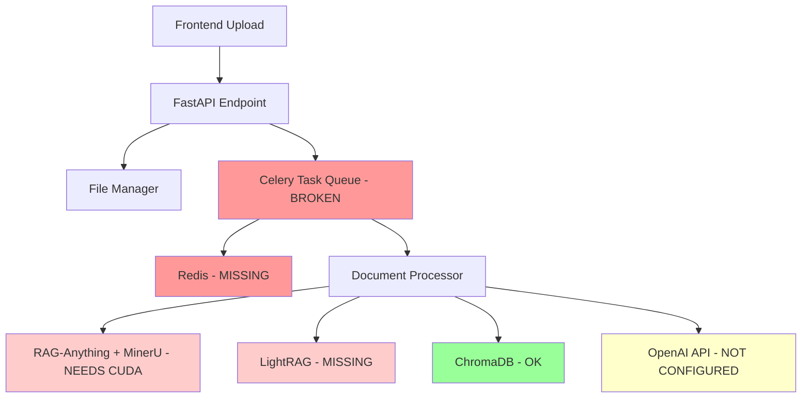
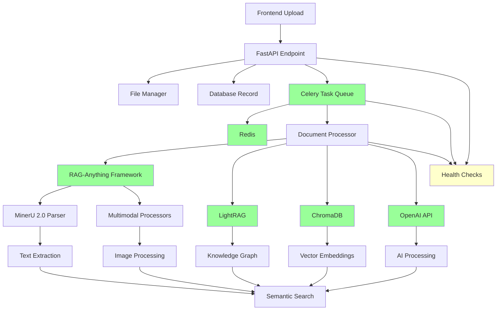

# Design Document

## Overview

This design addresses the complete setup of the AI PKM Tool with all required dependencies and services. The system currently has several missing components that prevent full functionality:

1. **Missing Redis Service**: Required for Celery task queue (causing 500 errors)
2. **Missing Celery Worker**: Required for background document processing
3. **Missing LightRAG**: Required for knowledge graph construction and advanced RAG
4. **RAG-Anything Configuration**: Multimodal processing framework (includes MinerU 2.0) needs CUDA setup
5. **Incomplete AI Configuration**: OpenAI API setup for real AI processing
6. **Service Integration Issues**: Proper startup, health checks, and error handling

The solution provides a comprehensive setup covering local development, Docker deployment, dependency installation, and service configuration.

## Architecture

### Current Architecture Issues



### Complete Architecture



## Components and Interfaces

### 1. Redis Service Setup

**Component**: Redis server for task queue
**Purpose**: Message broker for Celery tasks
**Configuration**:
- Local installation via package manager or Docker
- Connection string: `redis://localhost:6379/0`
- Persistence enabled for task reliability
- Memory optimization for document processing workloads

### 2. Celery Worker Configuration

**Component**: Background task processing
**Setup**:
- Fix docker-compose import path: `app.core.celery_app`
- Local worker command: `celery -A app.core.celery_app worker --loglevel=info`
- Queue configuration for different task types
- Auto-scaling based on workload

### 3. LightRAG Installation and Setup

**Component**: Knowledge graph and RAG capabilities
**Installation**: `pip install lightrag`
**Configuration**:
- Working directory: `./data/rag_storage`
- OpenAI API integration for LLM functions
- Embedding function configuration
- Query parameter setup for different RAG modes

### 4. RAG-Anything Multimodal Processing

**Component**: Multimodal document processing framework (includes MinerU 2.0)
**Installation**: Already installed via `raganything>=0.1.0`
**Configuration**:
- CUDA acceleration setup (PyTorch with CUDA support)
- MinerU integration via `raganything.mineru_parser`
- Device selection configuration file (`magic-pdf.json`)
- Multimodal processor configuration for different file types

### 5. OpenAI API Configuration

**Component**: AI model integration
**Setup**:
- Environment variable: `OPENAI_API_KEY`
- Optional base URL configuration
- Model selection (GPT-4o-mini, text-embedding-3-large)
- Rate limiting and error handling

### 6. Enhanced Health Check System

**Component**: Service monitoring and diagnostics
**Endpoints**:
- `/health/redis` - Redis connectivity
- `/health/celery` - Worker status
- `/health/lightrag` - LightRAG functionality
- `/health/raganything` - RAG-Anything and MinerU availability
- `/health/openai` - API key validation
- `/health/storage` - File system access

### 7. Comprehensive Error Handling

**Component**: Robust error management
**Features**:
- Service availability checks before operations
- Graceful degradation when services unavailable
- Detailed error logging with context
- User-friendly error messages
- Automatic retry logic for transient failures

## Data Models

### Enhanced Document Model

```python
class Document(Base):
    # Existing fields...
    processing_status: str  # queued, processing, completed, failed
    processing_error: Optional[str]  # Error details if failed
    task_id: Optional[str]  # Celery task ID
    retry_count: int = 0  # Number of processing retries
    last_retry_at: Optional[datetime]  # Last retry timestamp
```

### Task Status Response

```python
class TaskStatusResponse(BaseModel):
    task_id: str
    status: str  # pending, processing, completed, failed
    progress: int  # 0-100
    current_step: str
    error: Optional[str]
    estimated_completion: Optional[datetime]
```

## Error Handling

### Error Classification

1. **Client Errors (4xx)**:
   - Invalid file format
   - File too large
   - Missing required fields

2. **Server Errors (5xx)**:
   - Storage unavailable
   - Database connection failed
   - Celery worker unavailable

3. **Service Errors (503)**:
   - Redis unavailable
   - Background processing disabled

### Error Response Format

```python
class ErrorResponse(BaseModel):
    error: str
    error_code: str
    details: Optional[Dict[str, Any]]
    request_id: str
    timestamp: datetime
    suggestions: List[str]  # User-friendly suggestions
```

### Retry Strategy

```python
# Exponential backoff for transient failures
@celery_app.task(bind=True, autoretry_for=(ConnectionError, TimeoutError))
def process_document_task(self, document_id: str, file_path: str):
    try:
        # Processing logic
        pass
    except Exception as exc:
        # Log error and retry with backoff
        raise self.retry(exc=exc, countdown=60 * (2 ** self.request.retries))
```

## Testing Strategy

### Unit Tests

1. **File Manager Tests**:
   - File validation logic
   - Storage operations
   - Error handling scenarios

2. **Celery Task Tests**:
   - Task execution with mocked dependencies
   - Error handling and retry logic
   - Status update mechanisms

3. **API Endpoint Tests**:
   - Upload success scenarios
   - Various error conditions
   - Response format validation

### Integration Tests

1. **End-to-End Upload Flow**:
   - File upload through API
   - Celery task processing
   - Status updates and completion

2. **Service Dependency Tests**:
   - Redis connectivity
   - Database operations
   - File system access

3. **Error Recovery Tests**:
   - Service unavailability scenarios
   - Partial failure recovery
   - Data consistency checks

### Load Testing

1. **Concurrent Upload Tests**:
   - Multiple simultaneous uploads
   - Queue processing under load
   - Resource utilization monitoring

2. **Large File Tests**:
   - Maximum file size handling
   - Memory usage optimization
   - Timeout handling

## Deployment Options

### Option 1: Local Development Setup

**Prerequisites**:
- Python 3.9+
- Node.js 18+
- Redis server
- Git

**Setup Process**:
1. Install Redis locally
2. Install Python dependencies including LightRAG and MinerU
3. Configure environment variables
4. Start services in correct order
5. Verify functionality with health checks

### Option 2: Docker Compose Setup

**Prerequisites**:
- Docker and Docker Compose
- Git

**Setup Process**:
1. Use provided docker-compose.dev.yml
2. Build containers with all dependencies
3. Configure environment variables in compose file
4. Start all services with single command
5. Access application through configured ports

### Option 3: Hybrid Setup

**Prerequisites**:
- Docker for Redis
- Local Python environment

**Setup Process**:
1. Run Redis in Docker container
2. Install Python dependencies locally
3. Configure connection to containerized Redis
4. Start backend and Celery worker locally
5. Use Docker for additional services as needed

## Implementation Phases

### Phase 1: Core Services Setup
- Install and configure Redis
- Fix Celery configuration and start worker
- Verify basic task processing works
- Test document upload functionality

### Phase 2: AI Dependencies Installation
- Install LightRAG and configure knowledge graph
- Configure RAG-Anything multimodal processing with CUDA acceleration
- Configure OpenAI API integration
- Test advanced document processing features through RAG-Anything

### Phase 3: Integration and Health Checks
- Implement comprehensive health check endpoints
- Add service availability monitoring
- Improve error handling and user feedback
- Create setup automation scripts

### Phase 4: Testing and Documentation
- Create comprehensive test suite
- Write setup and troubleshooting documentation
- Performance testing and optimization
- Deployment guide creation